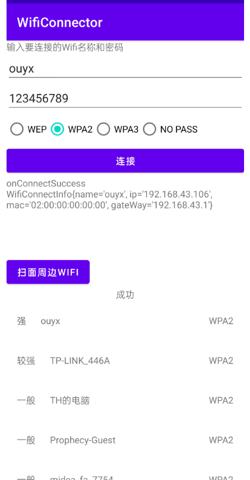

# WifiConnector

# Android Wifi 快速连接库

- minSdk 24

* 基于kotlin,协程 实现

* 提供连接WiFi热点功能 和 扫描附近列表功能 ，API支持Lambda表达式


  
 
 ## 详细用法参考demo

## 用法

### 1. 添加依赖

    dependencyResolutionManagement {
        repositories {
                ...
            maven { url 'https://jitpack.io' }
        }
    }

	dependencies {
	    implementation 'com.github.fizzuas:WifiConnector:1.0.0'	       
	}


### 2. 请取动态权限

* WiFi 扫描需要Manifest.permission.CHANGE_WIFI_STATE, Manifest.permission.ACCESS_FINE_LOCATION 权限

* WiFi 连接 
    - Build.VERSION.SDK_INT >= Build.VERSION_CODES.Q 时需要 Manifest.permission.ACCESS_FINE_LOCATION权限

    -  Build.VERSION.SDK_INT < Build.VERSION_CODES.Q 时 需要 Manifest.permission.CHANGE_WIFI_STATE, Manifest.permission.ACCESS_FINE_LOCATION权限


### 3. 初始化
    
    WifiConnector.get().init(application)


### 4. 连接

    WifiConnector.get().connect(ssid,pwd,chipType，timeoutInMilli){        
        onConnectStart {        
        }
        onConnectSuccess {
            //连接成功...
        }
        onConnectFail {
            val cause: String = when (it) {
                ConnectFailType.CancelByChoice -> "用户主动取消"
                ConnectFailType.ConnectTimeout -> "超时"
                ConnectFailType.ConnectingInProgress -> "正在连接中..."
                ConnectFailType.PermissionNotEnough -> "权限不够"
                ConnectFailType.SSIDConnected -> "目标SSID 已连接[${it.wifiConnectInfo}]"
                ConnectFailType.WifiNotEnable -> "WIFI未开启"
                ConnectFailType.ConnectUnavailable -> "连接失败"
                ConnectFailType.EncryptionPasswordNotNull -> "加密时密码不能为空"
                ConnectFailType.PasswordMustASCIIEncoded -> "秘密必须被ASCII编码"
                ConnectFailType.SsidInvalid -> "SSID 无效"
                }
            }
     }
 


* Android Q 之前使用 WifiManager.enableNetwork API连接 ，支持超时、连接过程中用户主动取消 
* Android Q 及之后 使用 requestNetwork 连接，因为系统会提供弹框或者系统界面来辅助连接所以不支持超时和用户主动取消连接
* 支持 WAP2 WAP3  WEP NO_PASS, 默认WPA2
* onConnectStart  onConnectSuccess onConnectFail 都在主线程


### 5. 扫描

    WifiConnector.get().scan {
        onScanStart {                
        }
        onScanSuccess { scanResults, parsedScanResults ->
        // scanResults 是系统扫描获取的WiFi列表
        // parsedScanResults是包括SSID、信号强度、加密类型 列表，并且按照强度由高到低排序
        }
        onScanFail {
            val errorMsg = when (it) {
                ScanFailType.LocationNotEnable -> "位置信息未开启"
                ScanFailType.PermissionNotGranted -> "需要ACCESS_FINE_LOCATION 和 CHANGE_WIFI_STATE 权限，参考https://developer.android.com/guide/topics/connectivity/wifi-scan?hl=zh-cn"
                ScanFailType.ScanningInProgress -> "当前正在扫描，请稍后再试.."
                ScanFailType.StartScanError -> "由于短时间扫描过多，扫描请求可能遭到节流"
            }
        }
    }

* onScanStart onScanSuccess  onScanFail 在主线程

### 6.获取当前连接的WiFi信息
```
    val connectInfo = WifiConnector.get().getConnectedInfo()
    // connectInfo 包括 ssid 、ip 、网关地址
    
```

### 7. 设置 WiFi连接状态 监听
``` 
               //设置 WiFi连接状态 监听
               WifiConnector.get().setWifiConnectionStatusListener {
                onConnected {
                    log.info(message = "连接上WiFi设备 $it")                 
                }
                onDisConnected {
                    log.info(message = "WiFi设备断开")                  
                }
            }
            
            //取消监听   
            WifiConnector.get().cancelWifiConnectionStatusListener()

```


### 8. 回收
    override fun onDestroy() {
        super.onDestroy()
        WifiConnector.get().release()
    }
